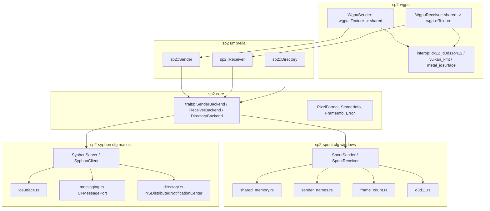

# sp2-rs 実装計画

最終更新: 2026-09-15

## 1. 目的

- Windows では Spout2 (2.007 系) のセンダー / レシーバー、macOS では Syphon (5 系) のサーバー / クライアントと **相互運用できる** 純 Rust 実装を提供する。
- C++ / Objective-C ライブラリのラッパーではなく、公開情報から得たプロトコル ([docs/research/spout2.md](research/spout2.md), [docs/research/syphon.md](research/syphon.md)) を Rust で再実装する。
- OS を意識しない統一 trait API (`sp2::Sender` / `sp2::Receiver` / `sp2::Directory`) を提供し、wgpu (D3D12 / Metal / Vulkan) から直接送受信できるようにする。

## 2. 対象外 (当面)

- OpenGL interop (`WGL_NV_DX_interop2`、Syphon OpenGL クライアント側の GL テクスチャ提供)
- SpoutCam / SpoutSettings / SpoutPanel 等の周辺ツール
- Linux バックエンド (Spout / Syphon 相当のエコシステムが存在しないため。将来的に独自プロトコルを検討)
- crates.io への公開作業 (手順のみ 9 章に記載)

## 3. アーキテクチャ

### 3.1 クレート構成

| クレート | 対象 OS | 役割 |
| --- | --- | --- |
| `crates/sp2-core` | 全て | OS 非依存の型 (`PixelFormat`, `SenderInfo`, `FrameInfo`, `Error`) と trait (`SenderBackend`, `ReceiverBackend`, `DirectoryBackend`) |
| `crates/sp2-spout` | Windows | Spout2 プロトコル実装 (`windows` クレート) |
| `crates/sp2-syphon` | macOS | Syphon プロトコル実装 (`objc2` 系クレート) |
| `crates/sp2` | 全て | umbrella。`cfg(target_os)` で実装を選択し統一 API を公開。非対応 OS では `Error::Unsupported` |
| `crates/sp2-wgpu` | Windows / macOS | wgpu 30 連携 (`WgpuSender` / `WgpuReceiver`) |

### 3.2 統一 API の設計方針

- **trait で共通化**: `SenderBackend` / `ReceiverBackend` / `DirectoryBackend` を `sp2-core` に定義し、各 OS 実装がこれを実装する。`sp2::Sender` 等は `cfg` により選択された実装型の薄い newtype で、trait をそのまま実装する。
- **CPU 経路は必須、ネイティブ経路は拡張**: すべての実装が `send_pixels` / `receive_pixels` を提供し、ネイティブテクスチャ (`ID3D11Texture2D`, `IOSurfaceRef`, `MTLTexture`) へのアクセスは各実装固有メソッドおよび `sp2::Sender::as_spout()` / `as_syphon()` のエスケープハッチで提供する。
- **Spout / Syphon の概念差の吸収**:

| 概念 | Spout | Syphon | 統一 API |
| --- | --- | --- | --- |
| 識別子 | センダー名 (一意、重複時は連番) | UUID (名前は重複可) | `SenderInfo.id` (Spout: 名前、Syphon: UUID) + `SenderInfo.name` |
| アプリ名 | `description` に実行ファイルパス | `AppNameKey` | `SenderInfo.app_name` |
| アクティブセンダー | あり (`ActiveSenderName`) | なし | `Directory::active_sender()` は Syphon では先頭サーバーを返す |
| フォーマット | 任意の `DXGI_FORMAT` | BGRA8 固定 | `PixelFormat` enum。Syphon は `Bgra8Unorm` のみ受理 |
| 新フレーム検出 | セマフォカウント | `NewFrame` メッセージ + seed | `Receiver::is_frame_new()` / `frame_id()` |
| 発見のための RunLoop | 不要 | メインスレッド RunLoop 必須 | `sp2::pump_events()` (Windows では no-op) |

## 4. 実装単位 (1 ブランチ 1 PR、コミット分割)

| # | コミット | 内容 |
| --- | --- | --- |
| 1 | `docs` | 調査メモ、ライセンス方針、本計画 |
| 2 | `license` | `LICENSE` を BSD 2-Clause に置換、`NOTICE` 追加、README 更新 |
| 3 | `skeleton` | workspace、`sp2-core`、`sp2` umbrella、CPU examples、空クレート、CI |
| 4 | `spout` | `sp2-spout` 実装 |
| 5 | `syphon` | `sp2-syphon` 実装 |
| 6 | `wgpu` | `sp2-wgpu` 実装 + wgpu examples |

## 5. `sp2-spout` (Windows) 設計

| モジュール | 内容 |
| --- | --- |
| `shared_memory.rs` | 名前付きファイルマッピング + `<name>_mutex` (67ms ロック)。`SharedMemory::create(name, size)` / `open(name)` / `lock()` |
| `registry.rs` | `HKCU\Software\Leading Edge\Spout` の DWORD 読み書き (`MaxSenders` 既定 64、`Framecount` 既定 1) |
| `sender_names.rs` | `SharedTextureInfo` (280 バイト) の LE エンコード / デコード、`SpoutSenderNames` 集合の読み書き、名前登録 (重複時 `name_1` 連番)、解除 (アクティブ引き継ぎ)、`ActiveSenderName` 操作、`partnerId` フラグ |
| `frame_count.rs` | `<name>_Count_Semaphore` (+2 / -1 方式)、`<name>_SpoutAccessMutex` (`check_access` / `allow_access`) |
| `d3d11.rs` | `D3D11CreateDevice` (BGRA サポート、外部デバイス注入可)、共有テクスチャ作成 (`MISC_SHARED` + `GetSharedHandle`)、`OpenSharedResource`、ステージングテクスチャ、`CopyResource` / `Flush` / `Map` |
| `sender.rs` | `SpoutSender`: 生成 → 登録 → 情報書き込み → 同期オブジェクト作成。`send_pixels` / `send_texture` はアクセスミューテックス内でコピー + `Flush` + `set_new_frame`。`resize`、Drop で解除 |
| `receiver.rs` | `SpoutReceiver`: 名前指定またはアクティブセンダーへ接続。毎フレーム情報を再読込しハンドル / サイズ変化で再オープン。`receive_texture` / `receive_pixels`、`is_frame_new` |
| `directory.rs` | センダー一覧、アクティブセンダー取得 / 設定、情報取得 |

互換性上の注意:

- 共有ハンドルはレガシー (KMT) ハンドルを使用する。既存受信アプリが `OpenSharedResource` を用いるため。
- ハンドルは 32 ビットに切り詰めて保存する (`HandleToLong` 相当)。
- 共有テクスチャを更新したデバイスでは必ず `Flush` する。

## 6. `sp2-syphon` (macOS) 設計

| モジュール | 内容 |
| --- | --- |
| `constants.rs` | 通知名、辞書キー、メッセージ種別、辞書バージョン |
| `uuid.rs` | `info.v002.Syphon.<CFUUID>` の生成 |
| `iosurface.rs` | IOSurface C API への最小 FFI (`IOSurfaceCreate`, `IOSurfaceLookup`, `Lock/Unlock`, `GetBaseAddress`, `GetBytesPerRow`, `GetSeed`, `GetID`) |
| `messaging.rs` | `MessageReceiver` (`CFMessagePortCreateLocal` + dispatch queue、`NSKeyedUnarchiver`)、`MessageSender` (`CFMessagePortCreateRemote` + `CFMessagePortSendRequest`、`NSKeyedArchiver` secure coding) |
| `directory.rs` | `NSDistributedNotificationCenter` 観測、`ServerAnnounceRequest` 送信、辞書パース、6 秒失効 |
| `run_loop.rs` | `poll(timeout)` (`CFRunLoopRunInMode`)。分散通知はメインスレッドの RunLoop でのみ配送されるため、ホストアプリのメインスレッドから定期的に呼ぶ |
| `server.rs` | `SyphonServer`: UUID ポート開設、クライアント管理、Announce / Update / Retire 送信、`publish_pixels`、`surface_texture(&MTLDevice)`、`publish()` |
| `client.rs` | `SyphonClient`: 自身のポート開設、Add / Remove メッセージ送信、`UpdateSurfaceID` / `NewFrame` / `RetireServer` 処理、`receive_pixels`、`frame_id`、`metal_texture(&MTLDevice)` |

## 7. `sp2-wgpu` 設計

| バックエンド | 方式 | コピー回数 |
| --- | --- | --- |
| macOS / Metal | IOSurface 裏付け `MTLTexture` を `wgpu_hal::metal::Device::texture_from_raw` でラップし `create_texture_from_hal::<Metal>`。送信は `copy_texture_to_texture` で共有テクスチャへ、受信はラップしたテクスチャを直接参照 (`receive_shared`) または自前テクスチャへコピー | 0 - 1 |
| Windows / D3D12 | `D3D11On12CreateDevice(ID3D12Device, ID3D12CommandQueue)` で D3D11 デバイスを作成し、`CreateWrappedResource` で wgpu の `ID3D12Resource` を D3D11 側にラップ。Spout 共有テクスチャと `CopyResource` (公式 spoutDX12 と同方式) | 1 |
| Windows / Vulkan | `VK_KHR_external_memory_win32` の `D3D11_TEXTURE_KMT` でレガシー共有ハンドルを `VkImage` としてインポートし `wgpu_hal::vulkan::Device::texture_from_raw` でラップ | 0 - 1 |
| その他 (GL 等) | CPU 経路にフォールバック (`copy_texture_to_buffer` → `send_pixels` / `receive_pixels` → `write_texture`) | CPU 往復 |

- `WgpuSender::send()` / `WgpuReceiver::receive()` は `TransferPath::{ZeroCopy, GpuCopy, CpuFallback}` を返し、サイレントな CPU フォールバックを避ける。
- wgpu 30 の `create_texture_from_hal(hal_tex, &desc, TextureUses)` と `Device::as_hal::<A>()` を使用する。wgpu バージョン依存コードは `interop/` 配下に隔離する。

## 8. example

| パス | 内容 |
| --- | --- |
| `crates/sp2/examples/list_senders.rs` | センダー / サーバー一覧とアクティブセンダーの表示 |
| `crates/sp2/examples/sender_cpu.rs` | CPU で生成したグラデーションを 60fps で送信 |
| `crates/sp2/examples/receiver_cpu.rs` | 受信フレームの解像度・fps・平均色を表示 |
| `crates/sp2-wgpu/examples/wgpu_sender.rs` | winit + wgpu で描画した内容をそのまま送信 |
| `crates/sp2-wgpu/examples/wgpu_receiver.rs` | 受信テクスチャをウィンドウに表示 |
| `crates/sp2-wgpu/examples/relay.rs` | 受信 → 加工 → 送信 |

相互運用テスト手順 (手動):

1. Windows: Spout SDK 同梱の `SpoutReceiver.exe` / `SpoutSender.exe` (Demo) と `sender_cpu` / `receiver_cpu` を相互に接続し、映像とフレームレートを確認する。
2. macOS: Syphon SDK 同梱の `Simple Server` / `Simple Client` と `sender_cpu` / `receiver_cpu` を相互に接続する。
3. wgpu examples を各 OS のバックエンド (D3D12 / Vulkan / Metal) で起動し `TransferPath` のログを確認する。

## 9. テスト・CI

- 単体テスト (OS 非依存): `SharedTextureInfo` レイアウト、センダー名テーブルの読み書き、`PixelFormat` 変換、Syphon 辞書パース、UUID 形式。
- クロスチェック: Linux 上で `cargo check --target x86_64-pc-windows-msvc` / `--target aarch64-apple-darwin`。
- GitHub Actions: ubuntu (fmt / clippy / test / クロス check)、windows-latest / macos-latest (build / test / examples build)。Windows ランナーは GPU が無いため D3D11 は WARP アダプタで動作確認する。
- crates.io 公開手順: `sp2-core` → `sp2-spout` / `sp2-syphon` → `sp2` → `sp2-wgpu` の順に `cargo publish`。各 `Cargo.toml` に `license = "BSD-2-Clause"` と `repository` を設定する。

## 10. リスクと対策

| リスク | 対策 |
| --- | --- |
| 開発環境 (Linux) で実機検証できない | 単体テスト + クロス check + CI マトリクス。相互運用テスト手順を文書化 |
| Spout レガシーハンドルの 32 ビット切り詰め | `HandleToLong` 相当で互換維持。64 ビット環境でもレガシーハンドルは 32 ビットに収まる |
| D3D11On12 ラップと wgpu の内部リソース状態の衝突 | `AcquireWrappedResources` / `ReleaseWrappedResources` と `Flush` で同期。失敗時は CPU 経路へフォールバック |
| 分散通知のメインスレッド制約 | `sp2::pump_events()` を必須 API としてドキュメント化 |
| 依存クレートのバージョン | `windows` 0.62、`objc2` 0.6、`objc2-metal` 0.3、`wgpu` 30。変更が必要な場合は事前に報告する |
