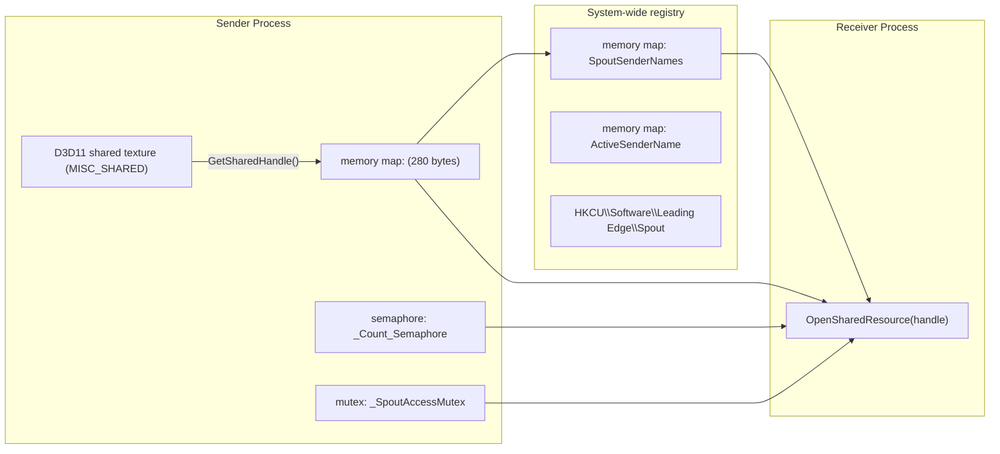
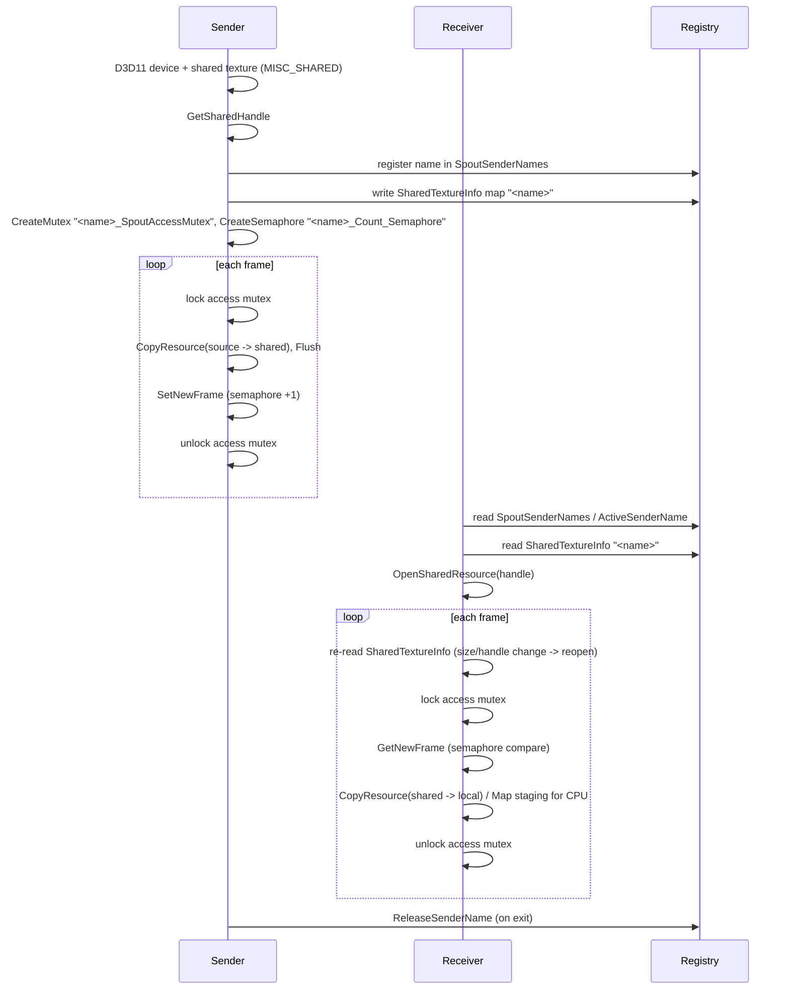

# Spout2 調査メモ

調査日: 2026-09-15
対象: [leadedge/Spout2](https://github.com/leadedge/Spout2) master ブランチ (SDK 2.007.017 系)

本メモは Spout2 の C++ ソースコードおよび公開ドキュメントから、
Rust で同じ挙動を再実装するために必要なプロトコル (OS オブジェクト名・メモリレイアウト・同期手順) を整理したものです。
ソースコードのコピーは行わず、「他プロセスから観測可能な挙動」のみを記録しています。

## 1. 概要

| 項目 | 内容 |
| --- | --- |
| ライセンス | BSD 2-Clause (Copyright (c) 2020-2025, Lynn Jarvis) |
| 最新版 | 2.007.017 (2.007.015 は 2024-08-27 リリース) |
| 対応 API | OpenGL (WGL_NV_DX_interop2 経由), DirectX 9 / 11 / 12 (DX12 は D3D11On12 経由) |
| 共有の基盤 | **DirectX 11 共有テクスチャ** (`D3D11_RESOURCE_MISC_SHARED`) |
| 主要利用アプリ | Resolume, TouchDesigner, vvvv, Unity/Unreal プラグイン, OBS (Spout2 plugin), Processing, Max/MSP, Notch, Magic Music Visuals, SpoutCam (仮想カメラ) 等 |
| 既存 Rust クレート | `spout-rs` (cxx ラッパー), `spout2-rs` / `spout2-sys` (C シムラッパー)。いずれも C++ SDK を同梱するラッパーであり、純 Rust 実装は存在しない |

## 2. アーキテクチャ

## 3. 共有メモリ (SpoutSharedMemory 相当)

- `CreateFileMappingA(INVALID_HANDLE_VALUE, NULL, PAGE_READWRITE, 0, size, name)` で名前付きページファイル backed のマップを作成。
- `OpenFileMappingA(FILE_MAP_ALL_ACCESS, FALSE, name)` で既存マップを開く。
- `MapViewOfFile(hMap, FILE_MAP_ALL_ACCESS, 0, 0, 0)` で全体をマップ。
- 各マップには **`<name>_mutex`** という名前付きミューテックスが付随し、`WaitForSingleObject(hMutex, 67ms)` で排他 (Lock) / `ReleaseMutex` で解放 (Unlock)。
- 既存マップを `Create` した場合 `ERROR_ALREADY_EXISTS` が返る (サイズは作成時のものが維持される)。

## 4. センダー登録 (SpoutSenderNames 相当)

### 4.1 `SpoutSenderNames` マップ

- 名前: `"SpoutSenderNames"`
- サイズ: `MaxSenders * 256` バイト。`MaxSenders` はレジストリ `HKCU\Software\Leading Edge\Spout\MaxSenders` (DWORD) から読み込み、未設定時は **64**。
- 内容: 256 バイト固定長の NUL 終端 ANSI 文字列 (センダー名) の配列。空文字で終端。
- 登録手順: マップをロック → 名前集合を読み込み → (最大数チェック) → 名前を追加 → 書き戻し → アンロック。
- 同名が存在する場合、`CreateSender` は `name_1`, `name_2`, ... と連番を付与して登録する (2.007.014 以降)。
- 解除 (`ReleaseSenderName`) 時、解除したセンダーが「アクティブセンダー」であれば、残った先頭のセンダーをアクティブに設定する。

### 4.2 `ActiveSenderName` マップ

- 名前: `"ActiveSenderName"`、サイズ 256 バイト。
- ユーザーが選択した (または最初に登録された) センダー名を保持し、受信側が名前指定なしで接続する際に使用する。

### 4.3 センダー情報マップ (`SharedTextureInfo`)

- 名前: センダー名そのもの (例: `"Spout Demo Sender"`)、サイズ **280 バイト**。
- レイアウト (すべてリトルエンディアン、32/64bit 互換のため `uint32_t`):

| オフセット | サイズ | フィールド | 内容 |
| --- | --- | --- | --- |
| 0 | 4 | `shareHandle` | D3D11 共有ハンドル (`HandleToLong` で 32bit に切り詰め) |
| 4 | 4 | `width` | テクスチャ幅 |
| 8 | 4 | `height` | テクスチャ高さ |
| 12 | 4 | `format` | `DXGI_FORMAT` (DX9 センダーは 0 または `D3DFMT_A8R8G8B8`=21) |
| 16 | 4 | `usage` | 未使用 (0) |
| 20 | 256 | `description` | 送信プロセスの実行ファイルパス (ANSI, NUL 埋め) |
| 276 | 4 | `partnerId` | フラグ: `0x80000000` = CPU 共有モード, `0x40000000` = GL/DX interop 互換 |

- 受信側は `GetSenderInfo(name)` でこの 280 バイトを読み、幅・高さ・ハンドル・フォーマットを取得する。
- 送信側はサイズ変更時に `UpdateSender` で書き換える。受信側は毎フレーム情報を読み、ハンドルまたはサイズが変わっていればテクスチャを再オープンする。

## 5. フレーム同期 (SpoutFrameCount 相当)

### 5.1 フレームカウント・セマフォ

- 名前: **`<sendername>_Count_Semaphore`**
- `CreateSemaphoreA(NULL, 1, LONG_MAX, name)`。送信側・受信側どちらが先に作成してもよい。
- 送信側 (`SetNewFrame`): `WaitForSingleObject(sem, 0)` (カウント -1) → `ReleaseSemaphore(sem, 2)` (カウント +2)。差分で **+1**。
- 受信側 (`GetNewFrame`): `WaitForSingleObject(sem, 0)` → `ReleaseSemaphore(sem, 1, &prev)` で現在値を取得。前回値と異なれば新フレーム。
- レジストリ `Framecount` (DWORD) が 0 の場合、フレームカウントは無効 (常に新フレーム扱い)。キーが無い場合は有効扱い。

### 5.2 テクスチャアクセス・ミューテックス

- 名前: **`<sendername>_SpoutAccessMutex`**
- 送信側は共有テクスチャへのコピー前に `WaitForSingleObject(mutex, 67ms)`、コピー後 `Flush()` してから `ReleaseMutex`。
- 受信側も同様にロック中に `CopyResource` を行う。ロック取得に失敗した場合はそのフレームをスキップする。

### 5.3 同期イベント (任意)

- 名前: `<sendername>_Sync_Event` (`CreateEventA`, 自動リセット)。`SetFrameSync` / `WaitFrameSync` による明示的な同期に用いる。初期実装では省略可能。

## 6. DirectX 11 テクスチャ

- 作成: `D3D11_TEXTURE2D_DESC { Width, Height, MipLevels=1, ArraySize=1, Format, SampleDesc={1,0}, Usage=DEFAULT, BindFlags=RENDER_TARGET|SHADER_RESOURCE, CPUAccessFlags=0, MiscFlags=D3D11_RESOURCE_MISC_SHARED }`
- 共有ハンドル取得: `IDXGIResource::GetSharedHandle` (レガシー/KMT ハンドル)。NT ハンドル (`MISC_SHARED_NTHANDLE` + `CreateSharedHandle`) は 2.007.014 以降オプションとして存在するが、**既存受信アプリは `ID3D11Device::OpenSharedResource` (レガシー) で開くため、互換性のためレガシーハンドルを既定とする**。
- 受信: `ID3D11Device::OpenSharedResource(handle, IID_ID3D11Texture2D)`。異なるアダプタで作成されたハンドルを開くとクラッシュし得るため、アダプタの一致確認が推奨される。
- 既定フォーマット: `DXGI_FORMAT_B8G8R8A8_UNORM` (87)。`R8G8B8A8_UNORM` (28)、`R16G16B16A16_FLOAT` (10)、`R32G32B32A32_FLOAT` (2)、`R10G10B10A2_UNORM` (24) 等も送受信可能。
- 共有テクスチャを更新したデバイスでは必ず `ID3D11DeviceContext::Flush()` を呼ぶ (異なるデバイス間の可視性保証)。

### 6.1 DirectX 12 との関係

- `ID3D12Device::OpenSharedHandle` は **NT ハンドルのみ** を受け付けるため、Spout のレガシーハンドルは D3D12 から直接開けない。
- Spout 公式 (`spoutDX12`) は `D3D11On12CreateDevice` で D3D12 デバイス上に D3D11 デバイスを作成し、`CreateWrappedResource` で D3D12 リソースを D3D11 側にラップして `CopyResource` する方式を採用している。
- Vulkan (`VK_KHR_external_memory_win32`) は `VK_EXTERNAL_MEMORY_HANDLE_TYPE_D3D11_TEXTURE_KMT_BIT` でレガシーハンドルをインポートできる。ただし標準 Spout の非 keyed テクスチャと名前付き CPU mutex だけでは D3D11 と Vulkan 間の GPU 同期を保証できず、wgpu の sampled texture レイアウトとも一致しないため、受信はインポート画像から wgpu 所有画像へ GPU コピーする。

## 7. レジストリ設定

キー: `HKEY_CURRENT_USER\Software\Leading Edge\Spout`

| 値 | 型 | 既定 | 意味 |
| --- | --- | --- | --- |
| `MaxSenders` | DWORD | 64 | センダー名テーブルの上限 |
| `Framecount` | DWORD | 1 | フレームカウント有効/無効 |
| `CPU` | DWORD | 0 | CPU 共有モード強制 |
| `Buffering` | DWORD | 0 | PBO バッファリング (GL 専用) |
| `Adapter` | DWORD | 0 | 使用アダプタ |

## 8. 送信・受信の標準シーケンス

## 9. 参考リンク

- リポジトリ: <https://github.com/leadedge/Spout2>
- LICENSE: <https://github.com/leadedge/Spout2/blob/master/LICENSE>
- 更新履歴: <https://github.com/leadedge/Spout2/blob/master/UPDATES.md>
- DirectX 12 サポートに関するアナウンス: <https://spout.discourse.group/t/directx-12-support/216>
- `IDXGIResource::GetSharedHandle`: <https://learn.microsoft.com/windows/win32/api/dxgi/nf-dxgi-idxgiresource-getsharedhandle>
