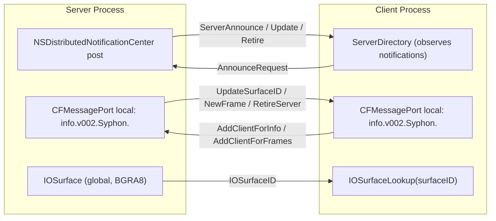
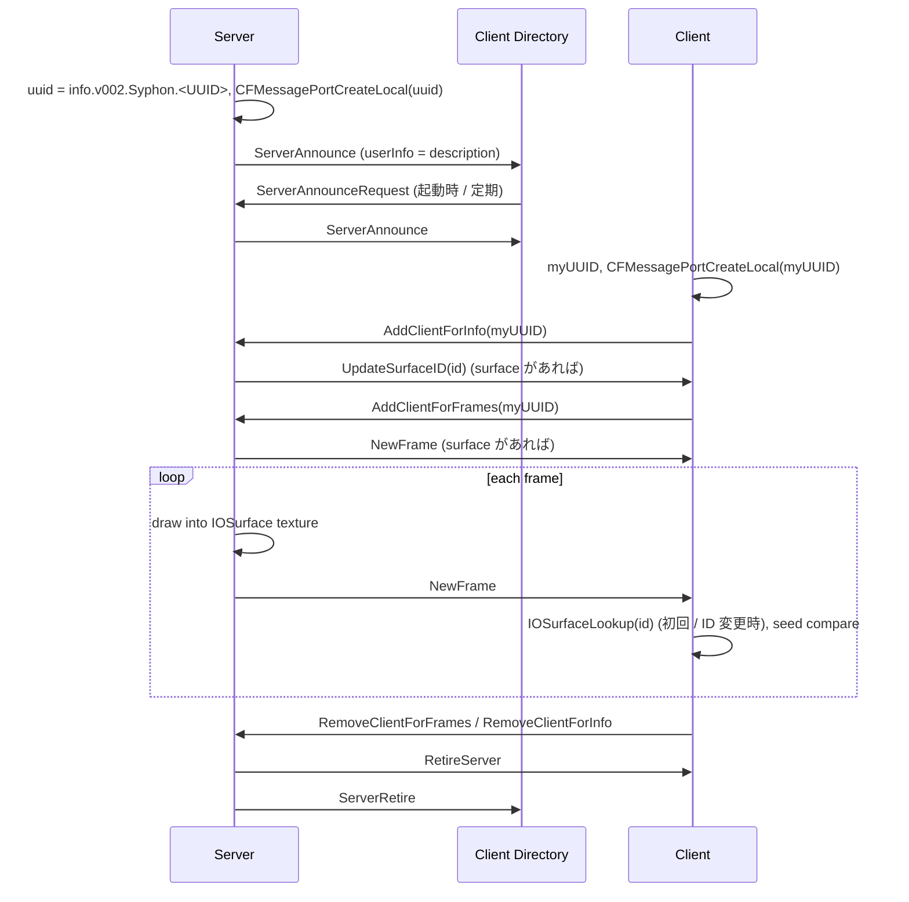

# Syphon 調査メモ

調査日: 2026-09-15
対象: [Syphon/Syphon-Framework](https://github.com/Syphon/Syphon-Framework) main ブランチ (Syphon 5 系、Metal 対応版)

本メモは Syphon.framework の Objective-C ソースコードおよび公開ドキュメントから、
Rust で同じ挙動を再実装するために必要なプロトコル (通知名・辞書キー・メッセージ種別・IOSurface 属性) を整理したものです。
ソースコードのコピーは行わず、「他プロセスから観測可能な挙動」のみを記録しています。

## 1. 概要

| 項目 | 内容 |
| --- | --- |
| ライセンス | Simplified BSD (3 条項: 著作権表示・免責の保持、非推奨条項) Copyright 2010 bangnoise (Tom Butterworth) & vade (Anton Marini) |
| 対応 API | OpenGL (Legacy / Core Profile), Metal (Syphon 5 以降、Millumin の協力で追加) |
| 共有の基盤 | **IOSurface** (`kIOSurfaceIsGlobal` 属性付き、BGRA8) |
| 主要利用アプリ | VDMX, Resolume, MadMapper, TouchDesigner, Millumin, CoGe, Quartz Composer / Max/Jitter / FFGL / Processing / Unity / OBS 用プラグイン等 |
| 既存 Rust クレート | `syphon-rs` / `syphon-core` / `syphon-metal` / `syphon-wgpu` (BlueJayLouche)。Syphon.framework へのバインディングであり、Framework の存在が前提。純 Rust 実装は存在しない |

## 2. アーキテクチャ

## 3. 定数

### 3.1 分散通知名 (`NSDistributedNotificationCenter`)

| 定数 | 文字列 | 送信者 | 内容 |
| --- | --- | --- | --- |
| `SyphonServerAnnounceRequest` | `info.v002.Syphon.ServerAnnounceRequest` | Directory | 全サーバーへ Announce を要求 (`object`, `userInfo` ともに nil) |
| `SyphonServerAnnounce` | `info.v002.Syphon.ServerAnnounce` | Server | サーバー記述辞書を `userInfo` に、UUID を `object` に載せて通知 |
| `SyphonServerUpdate` | `info.v002.Syphon.ServerUpdate` | Server | 名前変更時 (内容は Announce と同じ) |
| `SyphonServerRetire` | `info.v002.Syphon.ServerRetire` | Server | 停止時 (内容は Announce と同じ) |

- いずれも `postNotificationName:object:userInfo:deliverImmediately:YES` で送信する。
- 分散通知は **メインスレッドの RunLoop** (common modes) でのみ配送される (Apple ドキュメント)。CLI / ゲームループ型アプリでは `CFRunLoopRunInMode` を定期的に呼ぶ必要がある。

### 3.2 サーバー記述辞書のキー

| キー文字列 | 型 | 内容 |
| --- | --- | --- |
| `SyphonServerDescriptionDictionaryVersionKey` | NSNumber (unsigned int) | 辞書バージョン。現在 **0** |
| `SyphonServerDescriptionUUIDKey` | NSString | `info.v002.Syphon.<CFUUID 文字列>` |
| `SyphonServerDescriptionNameKey` | NSString | サーバー名 (空文字可) |
| `SyphonServerDescriptionAppNameKey` | NSString | アプリ名 (`NSRunningApplication.localizedName` → `NSProcessInfo.processName` の順でフォールバック) |
| `SyphonServerDescriptionSurfacesKey` | NSArray of NSDictionary | 各要素は `{ SyphonSurfaceType : SyphonSurfaceTypeIOSurface }` |
| `SyphonServerDescriptionIconKey` | NSImage | 受信側 (Directory) が `NSRunningApplication.icon` から補完する。通知には含めない |

- 表面種別: `SyphonSurfaceType` = `"SyphonSurfaceType"`, `SyphonSurfaceTypeIOSurface` = `"SyphonSurfaceTypeIOSurface"`。
- クライアントは `Surfaces` 配列に IOSurface 種別が含まれないサーバーには接続しない。

### 3.3 サーバーオプション

| キー | 内容 |
| --- | --- |
| `SyphonServerOptionIsPrivate` | YES の場合、分散通知でブロードキャストしない (UUID を知るクライアントのみ接続可能) |
| `SyphonServerOptionAntialiasSampleCount` 他 | OpenGL レンダラ用。Metal / Rust 実装では未使用 |

### 3.4 UUID 生成

`kSyphonIdentifier` (`"info.v002.Syphon"`) + `"."` + `CFUUIDCreateString(CFUUIDCreate())`
例: `info.v002.Syphon.6B29FC40-CA47-1067-B31D-00DD010662DA`

## 4. メッセージング (CFMessagePort)

- サーバーは自身の UUID 文字列を名前として `CFMessagePortCreateLocal` でポートを作成し、`CFMessagePortSetDispatchQueue` でシリアルキュー (`info.v002.syphon.messaging`, QoS user-interactive) 上でコールバックを受ける。
- クライアントも自身の UUID でローカルポートを作成し、サーバーからのメッセージを受ける。
- 送信は `CFMessagePortCreateRemote(name)` → `CFMessagePortSendRequest(port, msgid, data, sendTimeout=60, rcvTimeout=0, NULL, &returned)`。msgid にメッセージ種別、`data` にペイロード。
- ペイロードは `[NSKeyedArchiver archivedDataWithRootObject:payload requiringSecureCoding:YES]` でエンコードされ、受信側は `NSKeyedUnarchiver unarchivedObjectOfClasses:{NSString, NSNumber}` でデコードする。ペイロード無しの場合は `data` が NULL または空。
- ポートが無効 (`kCFMessagePortIsInvalid`) になった場合、相手は死んだものとして接続を破棄する。

### 4.1 クライアント → サーバー

| 種別値 | 名称 | ペイロード | 効果 |
| --- | --- | --- | --- |
| 0 | `AddClientForInfo` | クライアント UUID (NSString) | 名前変更・SurfaceID 変更・Retire を受け取る。登録直後に現在の SurfaceID が送られる |
| 1 | `AddClientForFrames` | クライアント UUID | 新フレーム通知を受け取る。登録時にサーフェスがあれば即 `NewFrame` が送られる |
| 2 | `RemoveClientForInfo` | クライアント UUID | 解除 |
| 3 | `RemoveClientForFrames` | クライアント UUID | 解除 |

### 4.2 サーバー → クライアント

| 種別値 | 名称 | ペイロード | 効果 |
| --- | --- | --- | --- |
| 0 | `UpdateServerName` | 新しい名前 (NSString) | 現行クライアントは無視 (Directory の Update 通知で処理) |
| 1 | `NewFrame` | なし | 新フレームが公開された |
| 2 | `UpdateSurfaceID` | `IOSurfaceID` (NSNumber unsigned int) | サーフェスが (再) 作成された。クライアントは `IOSurfaceLookup` し直す |
| 3 | `RetireServer` | なし | サーバー停止 |

## 5. IOSurface

- 作成属性:
  - `kIOSurfaceIsGlobal` = YES (他プロセスから `IOSurfaceLookup(ID)` で参照可能にする。非推奨 API だが Syphon 互換のため必須)
  - `kIOSurfaceWidth`, `kIOSurfaceHeight`
  - `kIOSurfacePixelFormat` = `kCVPixelFormatType_32BGRA` (`'BGRA'` = 0x42475241)
  - `kIOSurfaceBytesPerElement` = 4
- サイズ変更時は新しい IOSurface を作成し、`UpdateSurfaceID` を info クライアントに送る。
- フレーム更新の検出: クライアントは `IOSurfaceGetSeed()` を前回値と比較し、変化していれば `frameID` を加算する (`NewFrame` メッセージと併用)。
- CPU アクセス: `IOSurfaceLock(surface, options, &seed)` / `IOSurfaceGetBaseAddress` / `IOSurfaceGetBytesPerRow` / `IOSurfaceUnlock`。書き込み側は Unlock で seed が更新される。
- Metal: `[MTLDevice newTextureWithDescriptor:descriptor iosurface:surface plane:0]` で IOSurface 裏付けの `MTLTexture` (BGRA8Unorm, `RenderTarget | ShaderRead`) を作成し、`MTLBlitCommandEncoder` でコピー。コマンドバッファ完了ハンドラで `publish` (= `NewFrame` 送信) を行う。

## 6. サーバーのライフサイクル

- Directory は `ServerAnnounceRequest` を観測すると 6 秒後に「応答しなかったサーバー」をリストから除去する (死活監視)。
- サーバーは `NSProcessInfo beginActivityWithOptions:` で App Nap を抑止する。
- プロセス終了時に `stop` されていないサーバーは、デストラクタで UUID のみを含む `ServerRetire` 通知を送る。

## 7. 参考リンク

- リポジトリ: <https://github.com/Syphon/Syphon-Framework>
- License: <https://github.com/Syphon/Syphon-Framework/blob/main/License.txt>
- Getting Started: <https://github.com/Syphon/Syphon-Framework/blob/main/Syphon.docc/GettingStarted.md>
- 公式サイト: <https://syphon.info/>
- `NSDistributedNotificationCenter` (RunLoop 制約): <https://developer.apple.com/documentation/foundation/distributednotificationcenter>
